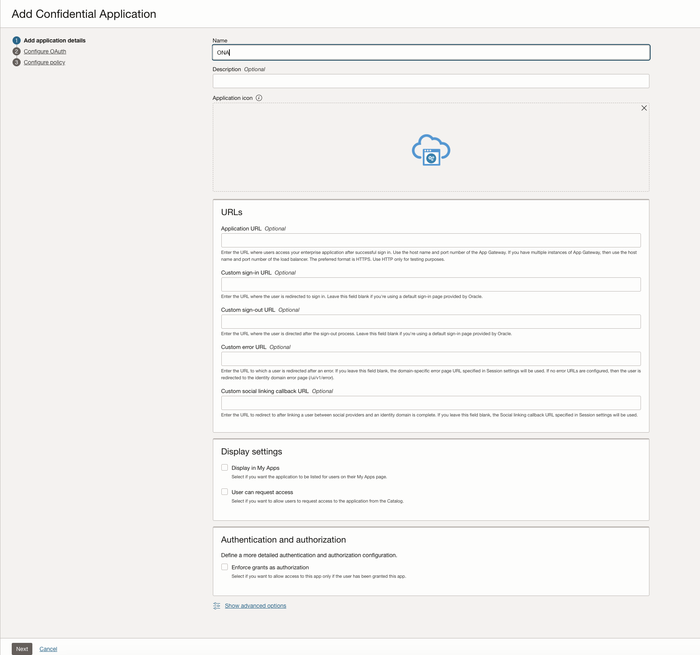
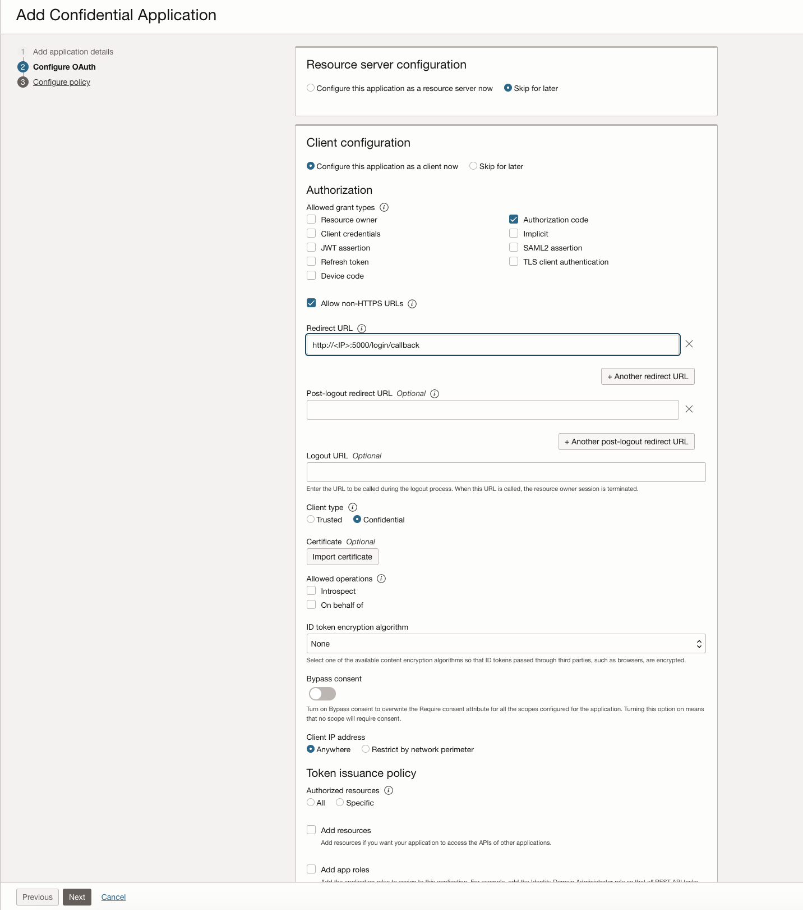
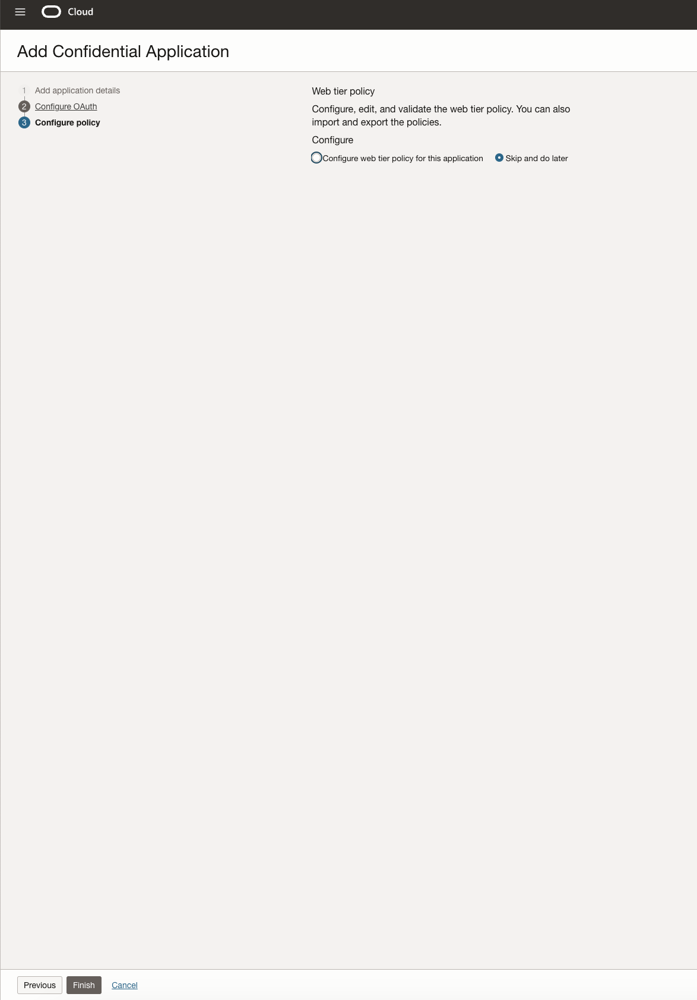
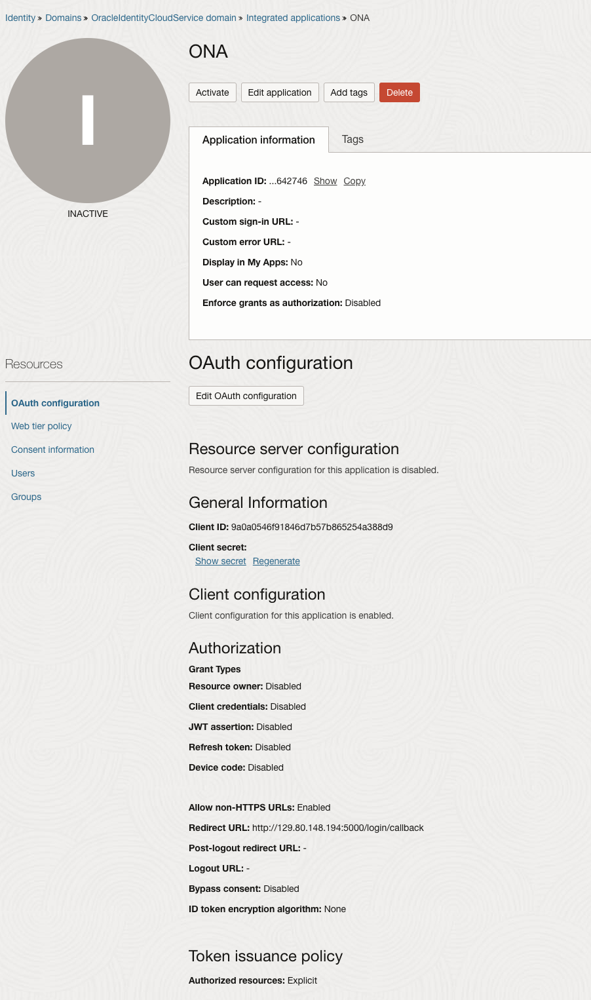
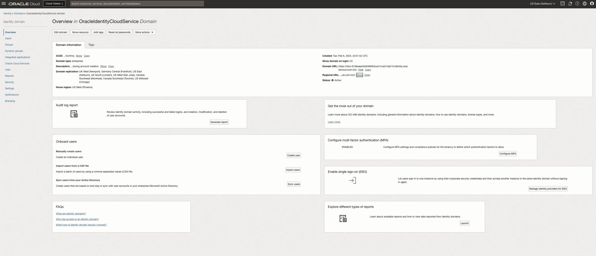

#SETUP#
Log into OCI and Create a Confidential Application and retrieve the CLIENT ID, SECRET AND URL

Get the Domain URL

#INSTALL#

git clone https://github.com/cj667113/ONA.git

#DOCKER BUILD#
docker build --no-cache -t ona .

#DOCKER#
To run ONA as a docker container run:
  ADDRESS=IP of the NODE
  ORACLE_CLIENT_ID= ID FROM OCI CONFIDENTIAL APP
  ORACLE_IDCS_SECRET=SECRET FROM OCI CONFIDENTIAL APP
  ORACLE_IDCS_URL=Domain URL
  docker run --network host --privileged -d --restart always -e ORACLE_CLIENT_ID="$ORACLE_CLIENT_ID" -e ORACLE_IDCS_SECRET="$ORACLE_IDCS_SECRET" -e ORACLE_IDCS_URL="$ORACLE_IDCS_URL" -e ADDRESS="http://$ADDRESS:5000" ona

#Log in#

In a web browser go to http://$ADDRESS:5000