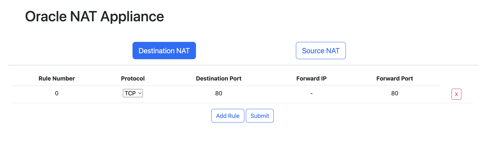

# ONA Setup and Deployment Guide

## Step 1: Create a Compute Instance and Gather Public IP Address

1. Log in to your OCI account and navigate to the Compute Instances page.
2. Create a new Compute Instance and note down its public IP address.

## Step 2: Create a Confidential Application

**Important:** Due to a bug in the OCI Console, you may need to leave the "Allow non-HTTPS URLs" box unchecked during creation. You can re-add it after creating the Confidential Application.

Use the public IP address of the Compute Node in the redirect URL.

Create a Confidential Application and retrieve the CLIENT ID, SECRET AND URL and enable the Confidential Application.

Make sure to enable the Confidential Application in the OCI Console.

Get the Domain URL

## Step 3: Clone the Git Repo
    git clone https://github.com/cj667113/ONA.git

## Step 4: Install Docker
https://docs.docker.com/engine/install/

## Step 5: Docker Build
    docker build --no-cache -t ona .

## Step 6: Run Docker Container
To run ONA as a docker container run:

    ADDRESS=IP of the NODE
    ORACLE_CLIENT_ID= ID FROM OCI CONFIDENTIAL APP
    ORACLE_IDCS_SECRET=SECRET FROM OCI CONFIDENTIAL APP
    ORACLE_IDCS_URL=Domain URL

    docker run --network host --privileged -d --restart always -e ORACLE_CLIENT_ID="$ORACLE_CLIENT_ID" -e ORACLE_IDCS_SECRET="$ORACLE_IDCS_SECRET" -e ORACLE_IDCS_URL="$ORACLE_IDCS_URL" -e ADDRESS="http://$ADDRESS:5000" ona

## Step7: Access the UI
In a web browser go to http://$ADDRESS:5000

After you Log into the appliance you should be redirected back to a page like this:

