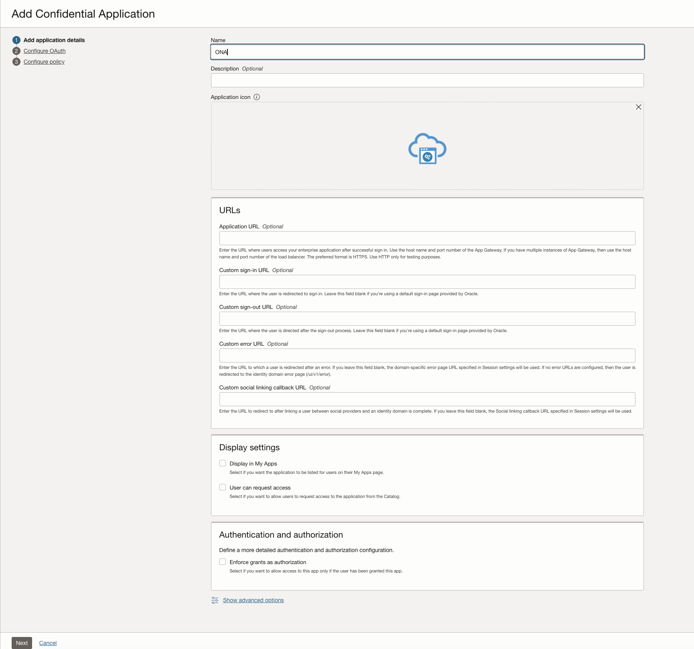
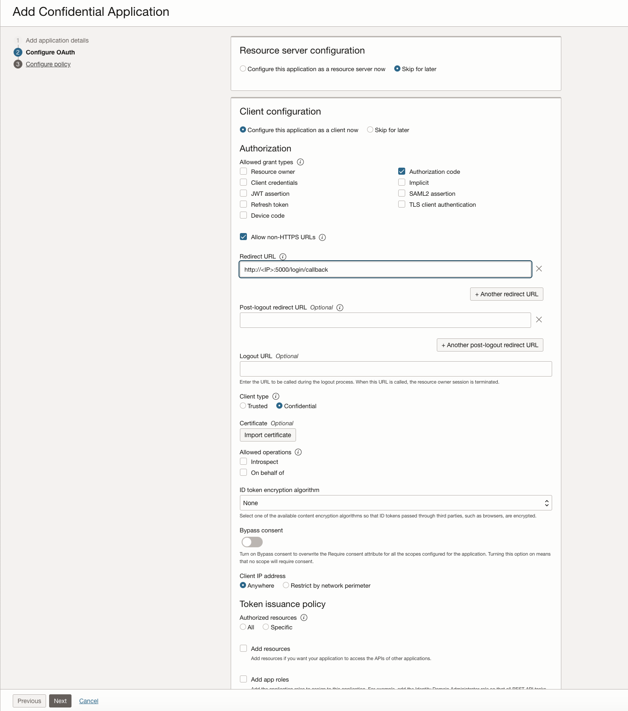
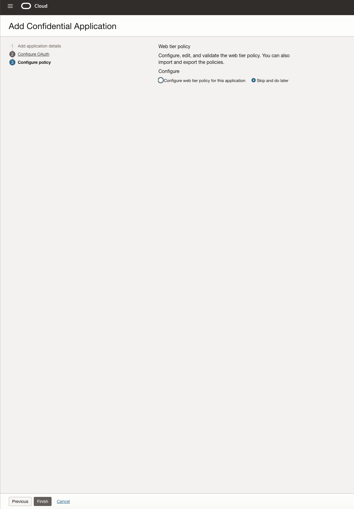
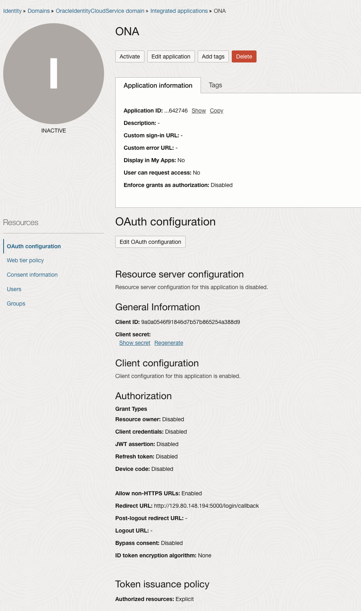
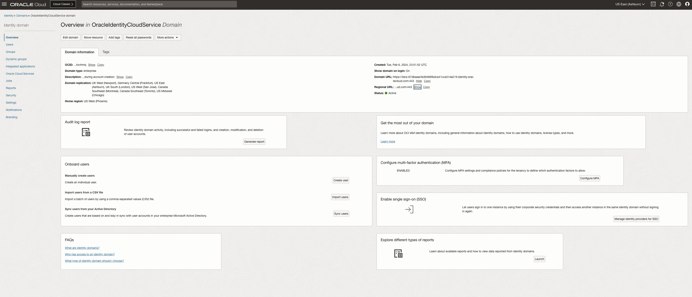
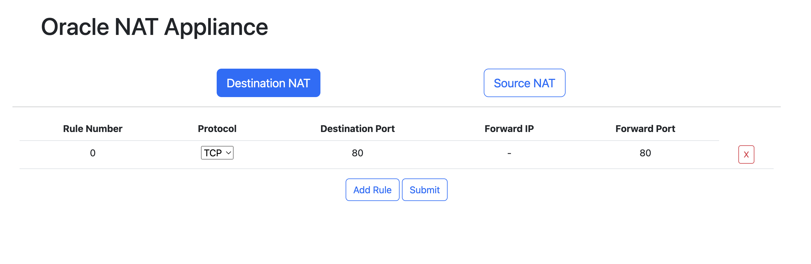

# ONA Setup and Deployment Guide

## Step 1: Create a Compute Instance and Gather Public IP Address

1. Log in to your OCI account and navigate to the Compute Instances page.
2. Create a new Compute Instance and note down its public IP address.

## Step 2: Create a Confidential Application

**Important:** Due to a bug in the OCI Console, you may need to leave the "Allow non-HTTPS URLs" box unchecked during creation. You can re-add it after creating the Confidential Application.

Use the public IP address of the Compute Node in the redirect URL.

Create a Confidential Application and retrieve the CLIENT ID, SECRET AND URL and enable the Confidential Application.

Make sure to enable the Confidential Application in the OCI Console.

Get the Domain URL

## Step 3: Clone the Git Repo
    git clone https://github.com/cj667113/ONA.git

## Step 4: Install Docker
https://docs.docker.com/engine/install/

## Step 5: Docker Build
Run this from the repository root:

    docker build --no-cache -f docker/Dockerfile -t ona .

## Step 6: Run Docker Container
To run ONA as a docker container run:

    ADDRESS=https://DNS_NAME_FOR_THE_NODE
    ORACLE_CLIENT_ID=ID FROM OCI CONFIDENTIAL APP
    ORACLE_IDCS_SECRET=SECRET FROM OCI CONFIDENTIAL APP
    ORACLE_IDCS_URL=Domain URL
    ONA_SECRET_KEY=$(openssl rand -hex 32)

    docker run --network host --privileged -d --restart always \
      -v ona-config:/ONA/flask/instance \
      -e ORACLE_CLIENT_ID="$ORACLE_CLIENT_ID" \
      -e ORACLE_IDCS_SECRET="$ORACLE_IDCS_SECRET" \
      -e ORACLE_IDCS_URL="$ORACLE_IDCS_URL" \
      -e ADDRESS="$ADDRESS" \
      -e ONA_SECRET_KEY="$ONA_SECRET_KEY" \
      ona

Use an HTTPS `ADDRESS` when TLS is terminated in front of the container. For lab-only direct Flask HTTP deployments, set `ADDRESS=http://IP_OR_DNS_OF_THE_NODE:5000` and add `-e OAUTHLIB_INSECURE_TRANSPORT=1`.

## Step 7: Optional Object Storage Backups
The Backups panel in the UI can list Object Storage buckets, create zip backups of the ONA-managed iptables rules, schedule recurring backups, and restore a selected backup.

By default, ONA uses OCI instance principal authentication. Put the compute instance in a dynamic group and grant it access to the backup compartment, for example:

    Allow dynamic-group ONA_DYNAMIC_GROUP to inspect buckets in compartment ONA_COMPARTMENT
    Allow dynamic-group ONA_DYNAMIC_GROUP to manage objects in compartment ONA_COMPARTMENT

In the UI, enter the region, compartment OCID, optional namespace, refresh buckets, select a bucket, set retention, and save the backup policy. Scheduled backups can be enabled or disabled from the panel and run inside the Flask process once per minute, so deploy one ONA app process for a single backup schedule owner.

The gateway dashboard streams updates in place about every 30 seconds with CPU, memory, conntrack, NAT port, connection, packet, and network throughput statistics.

## Step 8: Optional Secondary VNIC SNAT Pool
ONA can scan the instance metadata service for attached VNICs and their primary or secondary private IPs. After adding or configuring secondary VNICs on the instance, use `Rescan VNICs` in the UI, select the configured private IPs, choose the output interface, and apply the SNAT source pool.

For NAT forwarding, disable source/destination check on every VNIC used by the appliance. Secondary VNICs must also be configured in the operating system before ONA can safely use their IPs as SNAT sources.

## Step 9: Access the UI
In a web browser go to `$ADDRESS`.

After you Log into the appliance you should be redirected back to a page like this:

